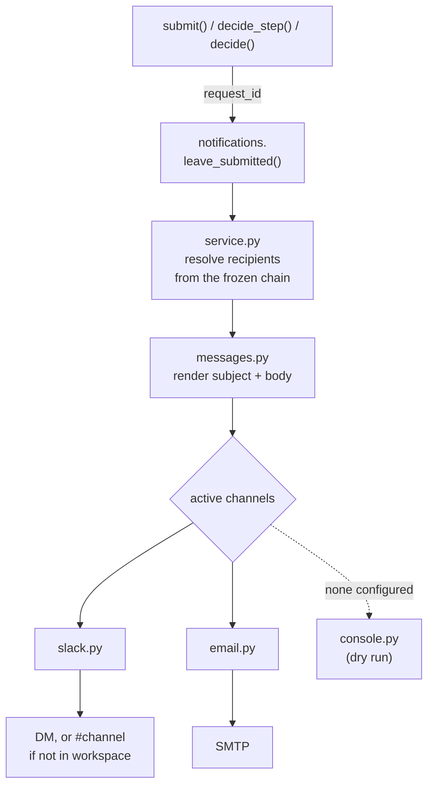

# Notifications

> Status: **built, wired, and verified against live Slack and Gmail.** Both
> directions confirmed delivering — see *Verified runs* below.

## What it does

When a leave request moves, the people affected are told. Both directions of
the conversation are covered:

```
Ananya submits            ->  Rahul   "Leave request awaiting you"
Rahul approves (1 of 4)   ->  Ananya  "Progress - your Annual Leave"
                          ->  Priya   "Leave request awaiting you"
Suresh approves (final)   ->  Ananya  "Approved - your Annual Leave"
Anyone rejects            ->  Ananya  "Declined - your Annual Leave"
Ananya cancels            ->  whoever was still holding it
```

Delivery is over Slack, email, or both at once. With nothing configured every
message is rendered to the log instead, so the flow is testable before any
account exists.

## The five events

| Event | Fired from | Goes to |
| --- | --- | --- |
| Request submitted | [`submit()`](../backend/app/services/leave_request_service.py#L190) | the approver the chain landed on |
| Tier cleared, more remain | [`decide_step()`](../backend/app/services/approval_service.py#L196) | the employee **and** the next approver |
| Fully approved | [`decide_step()`](../backend/app/services/approval_service.py#L196) | the employee |
| Rejected | [`decide_step()`](../backend/app/services/approval_service.py#L196) | the employee |
| Cancelled | [`decide()`](../backend/app/services/leave_request_service.py#L344) | approvers who were still pending |

Every message states the chargeable figure *and how it was reached* —
`3 chargeable (5 calendar days - 2 non-working)`. That number is the one thing
recipients query, so answering it in the notification saves the round trip.

## Recipients come from the frozen chain

This is the design decision most likely to be undone by accident.

The obvious implementation reads `employee.manager_id` and emails that person.
It is wrong. A request whose tier 1 is unreachable — no manager assigned, the
manager is the requester themselves — is routed straight to tier 2, and the
step is recorded as `SKIPPED`. Emailing `manager_id` would notify somebody who
has nothing to decide while the person actually holding the request hears
nothing.

So recipients are read from `leave_request_approval` via
[`leave_submitted()`](../backend/app/notifications/service.py#L144) and
[`step_decided()`](../backend/app/notifications/service.py#L176) — the same rows the
approvals queue is driven by. Whoever the engine says must act is whoever gets
told, by construction.

The same applies to the HR step. A role approver sits outside the reporting
line entirely, so no walk up the org chart could ever reach them.

## Two invariants

### Never raise

A notification is a side effect of an action, never a precondition for it.
Nobody should be unable to book leave because an SMTP server is unreachable.

Every channel swallows its own errors and returns a boolean — the contract is
stated on [`Channel.send()`](../backend/app/notifications/channels/base.py#L55). The
dispatcher in [`_deliver()`](../backend/app/notifications/service.py#L54) additionally
wraps each call, because a third-party client that breaks its own
contract must still not take down the request.

### Never block

`smtplib` and `slack_sdk` are both synchronous, and this is an async
application. Calling either directly inside a request handler blocks the event
loop for the length of the TLS handshake and login — seconds against Gmail —
freezing **every other request in the process**, not just this one.

Both run in a worker thread via `asyncio.to_thread`
([email](../backend/app/notifications/channels/email.py#L32),
[slack](../backend/app/notifications/channels/slack.py#L51)), and dispatch itself is
fire-and-forget in [`_fire()`](../backend/app/notifications/service.py#L83): the HTTP response returns as soon as the state change is
durable, and delivery catches up behind it.

```python
task = asyncio.create_task(_deliver(recipient, message))
_INFLIGHT.add(task)                      # asyncio holds only weak references;
task.add_done_callback(_INFLIGHT.discard)  # without this the send can vanish
```

## Every channel gets every message

Channels are **not** alternatives tried in order. All configured channels
receive all messages — see [`_deliver()`](../backend/app/notifications/service.py#L54)
and the [`_ALL` registry](../backend/app/notifications/channels/__init__.py#L19).

An earlier version stopped at the first success, which meant switching Slack on
silently switched email off — never what "also post to Slack" is taken to mean.
They also reach different audiences: a Slack channel is a team feed, an email is
addressed to the individual.

The console channel is the exception. It is not in the list; it is the floor the
dispatcher falls back to when nothing else is configured at all.

## Architecture

| File | Role |
| --- | --- |
| [`__init__.py`](../backend/app/notifications/__init__.py) | the public API — three events + a status helper |
| [`service.py`](../backend/app/notifications/service.py) | who gets told what; resolves recipients; dispatches |
| [`messages.py`](../backend/app/notifications/messages.py) | templates: one event → one channel-agnostic `Message` |
| [`channels/__init__.py`](../backend/app/notifications/channels/__init__.py) | the registry |
| [`channels/base.py`](../backend/app/notifications/channels/base.py) | the port: `Channel`, `Recipient`, `Message` |
| [`channels/slack.py`](../backend/app/notifications/channels/slack.py) | DM by email, falling back to a channel |
| [`channels/email.py`](../backend/app/notifications/channels/email.py) | SMTP |
| [`channels/console.py`](../backend/app/notifications/channels/console.py) | dry run |

The rest of the application imports exactly this:

```python
from app import notifications
await notifications.leave_submitted(request_id)
```

It never sees a channel, a template, or an address. Swapping delivery
mechanisms touches nothing outside the package.



[`_context()`](../backend/app/notifications/service.py#L105) reaches into **repositories**
directly, never into `leave_request_service`. Services import notifications, so notifications must
not import services — that would be a cycle. It keeps the package
self-contained: given a `request_id` it can assemble everything itself.

The day breakdown is **recomputed** from the region's rules rather than passed
in, so a notification can never disagree with what the screens show. Both
derive from `calc_working_days` over the same inputs.

## Code map

Everything the feature touches, in one place.

### Where it fires

| Trigger | Code | Calls |
| --- | --- | --- |
| Leave submitted | [`leave_request_service.py:190`](../backend/app/services/leave_request_service.py#L190) | [`leave_submitted()`](../backend/app/notifications/service.py#L144) |
| Step approved / rejected | [`approval_service.py:196`](../backend/app/services/approval_service.py#L196) | [`step_decided()`](../backend/app/notifications/service.py#L176) |
| Request cancelled | [`leave_request_service.py:344`](../backend/app/services/leave_request_service.py#L344) | [`leave_cancelled()`](../backend/app/notifications/service.py#L230) |

The cancel path captures who was waiting
[before the steps are skipped](../backend/app/services/leave_request_service.py#L330) —
afterwards nothing is `PENDING` and there is no record of who to stand down.

### The pipeline

| Stage | Code |
| --- | --- |
| Public API | [`__init__.py`](../backend/app/notifications/__init__.py) |
| Resolve recipients | [`_context()`](../backend/app/notifications/service.py#L105) |
| Schedule delivery | [`_fire()`](../backend/app/notifications/service.py#L83) |
| Fan out to channels | [`_deliver()`](../backend/app/notifications/service.py#L54) |
| Pick active channels | [`active()`](../backend/app/notifications/channels/__init__.py#L24) |

### Templates

| Message | Code |
| --- | --- |
| "Leave request awaiting you" | [`awaiting_approval()`](../backend/app/notifications/messages.py#L80) |
| "Approved - your ..." | [`approved()`](../backend/app/notifications/messages.py#L96) |
| "Declined - your ..." | [`rejected()`](../backend/app/notifications/messages.py#L106) |
| "Progress - your ..." | [`step_cleared()`](../backend/app/notifications/messages.py#L119) |
| "Withdrawn - ..." | [`cancelled()`](../backend/app/notifications/messages.py#L135) |
| The day-breakdown line | [`_breakdown()`](../backend/app/notifications/messages.py#L49) |

### Channels

| Channel | Class | Delivery |
| --- | --- | --- |
| Slack | [`SlackChannel`](../backend/app/notifications/channels/slack.py#L34) | [`_send_blocking()`](../backend/app/notifications/channels/slack.py#L63) · [`_resolve()`](../backend/app/notifications/channels/slack.py#L96) |
| Email | [`EmailChannel`](../backend/app/notifications/channels/email.py#L25) | [`_send_blocking()`](../backend/app/notifications/channels/email.py#L43) |
| Console | [`ConsoleChannel`](../backend/app/notifications/channels/console.py#L16) | [`send()`](../backend/app/notifications/channels/console.py#L24) |

### Supporting changes

| Change | Code | Why |
| --- | --- | --- |
| Settings | [`config.py:27-51`](../backend/app/config.py#L27-L51) | SMTP, Slack, base URL, master switch |
| Logging at INFO | [`main.py:23-32`](../backend/app/main.py#L23-L32) | without it every dispatch log was discarded |
| Channel status on health | [`router.py:19`](../backend/app/routers/v1/router.py#L19) | answers "why did no mail arrive" without logs |
| Editable employee email | [`employees.py:50`](../backend/app/routers/v1/employees.py#L50) · [`employee_service.py:91`](../backend/app/services/employee_service.py#L91) | seeded placeholders must be repointable at real inboxes |

## Configuration

All in `backend/.env` (gitignored — never commit it; this repo is public).

| Key | Default | Notes |
| --- | --- | --- |
| [`NOTIFICATIONS_ENABLED`](../backend/app/config.py#L47) | `true` | master switch; messages still render to the log when off |
| [`APP_BASE_URL`](../backend/app/config.py#L28) | `http://localhost:5174` | the link in every message |
| [`SMTP_SERVER`](../backend/app/config.py#L32) | `smtp.gmail.com` | |
| `SMTP_PORT` | `587` | STARTTLS |
| `SMTP_USERNAME` | — | also the sender address |
| `SMTP_PASSWORD` | — | **16-character App Password**, not the account password |
| `SMTP_TIMEOUT` | `10.0` | seconds |
| [`SLACK_BOT_TOKEN`](../backend/app/config.py#L39) | — | needs `chat:write` and `users:read.email` |
| `SLACK_HR_CHANNEL_ID` | — | fallback when a person is not in the workspace |

[`GET /api/v1/health`](../backend/app/routers/v1/router.py#L19) reports what is actually
switched on, via [`describe()`](../backend/app/notifications/channels/__init__.py#L35):

```json
{"status":"ok","version":"v1",
 "notifications":{"active":["slack","email"],
                  "available":{"slack":true,"email":true}}}
```

Reported there because "the email never arrived" is almost always a
configuration question, and this answers it without reading logs.

### Email

There is deliberately **no `FROM_EMAIL`**. Gmail rewrites a From header that
does not match the authenticated account, so configuring both invites them to
disagree silently. The SMTP username is the sender.

`SMTP_PASSWORD` must be an App Password from
<https://myaccount.google.com/apppasswords>, which requires 2-Step Verification.
The normal account password fails with a misleading error, so the channel
[detects `SMTPAuthenticationError`](../backend/app/notifications/channels/email.py#L63)
and logs the real cause.

### Slack

A DM is preferred: addressed, private, and it reaches the person rather than a
room. It requires that person to exist in the workspace under **the same
address held in the employee table**, which seeded staff will not.

[`_resolve()`](../backend/app/notifications/channels/slack.py#L96) decides where to post:

1. `users_lookupByEmail` → DM that user
2. failing that, post to `SLACK_HR_CHANNEL_ID`, naming the intended recipient
   (a channel post is not addressed, so it has to say who it concerns)
3. failing that, log a warning

If the bot is not in the target channel, Slack returns `not_in_channel` — the
channel detects it and says to run `/invite @<bot>` rather than reporting a
generic failure.

`slack_sdk` is an **optional** dependency. The
[import is guarded](../backend/app/notifications/channels/slack.py#L23), so the app starts
and every other channel keeps working when it is absent.

## Adding a channel

Two steps, no changes anywhere else:

1. Write a class in `channels/` satisfying the
   [`Channel` protocol](../backend/app/notifications/channels/base.py#L41) —
   `name`, `is_configured`, `async send(recipient, message) -> bool`.
   [`console.py`](../backend/app/notifications/channels/console.py#L16) is the smallest
   worked example.
2. Add it to [`_ALL`](../backend/app/notifications/channels/__init__.py#L19) in
   `channels/__init__.py`.

Nothing in the application knows which channels exist.

## Verified runs

Confirmed with live credentials, both directions:

```
Ananya submits Casual Leave (7-9 Dec 2026, 3 chargeable)
  slack: sent 'Leave request awaiting you - Ananya Iyer' to U0BQLHAAKBR
  email: sent 'Leave request awaiting you - Ananya Iyer' to <Rahul>
  notify: -> <Rahul> via slack, email

Rahul approves
  slack: sent 'Approved - your Casual Leave' to U0BR160PMGA
  email: sent 'Approved - your Casual Leave' to <Ananya>
  notify: -> <Ananya> via slack, email
```

### Testing without credentials

Leave `SMTP_USERNAME` and `SLACK_BOT_TOKEN` unset. Every message renders to the
log with its full recipient, subject and body. Routing, templating and recipient
resolution are exercised exactly as in production — only the final hop changes.

## Known limits

| Limit | Consequence |
| --- | --- |
| **No outbox / no retry** | fire-and-forget. A message in flight when the process dies is lost, not retried. An outbox table written in the same transaction as the state change would fix this. |
| **No in-app notifications** | the topbar bell is not wired to anything. The same events could populate a `notification` table to drive it. |
| **Placeholder addresses fail silently** | staff on `@meridian.io` get nothing. Logged as a warning, but no bounce surfaces in the UI. |
| **No per-user preferences** | everyone gets everything, on every configured channel. No opt-out, no digest. |
| **Slack DM needs workspace membership** | under the same address as the employee record, or it falls back to the channel. |
| **No authentication anywhere** | the API trusts whatever employee id it is given, so notifications can be triggered by anyone who can reach it. The standing structural gap across the whole project. |

## Related

- [multi-tier-approval.md](multi-tier-approval.md) — the chain notifications read from
- [ACCRUAL-SPEC.md](ACCRUAL-SPEC.md) — where the day figures in messages come from
